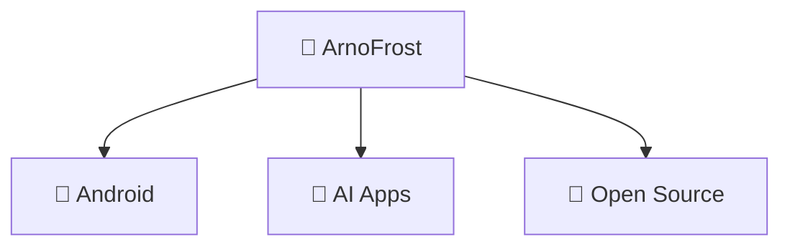

# 👋 Hi there, I'm ArnoFrost!

---

## 📊 GitHub Analytics

  <!-- 详细的用户概要卡片 -->
  

  <!-- GitHub 统计卡片 -->
  
  <!-- 最常用语言卡片 -->
  

  <!-- 提交时间分布 -->
  

---

## 🚀 Featured Projects

### 🤖 AI Collaboration Tools

### 🛠️ Developer Tools

### 📱 Android Projects

---

## 🛠️ Tech Stack

### 📱 Android Development

### 🤖 AI Exploration

### 🔧 Tools

---

## 🎯 Current Focus

---

## 📈 Contribution Activity

  

---

## 🏆 GitHub Achievements

---

## 💼 Professional Summary

**🎯 Android Client Engineer** | **Kotlin & Java**

Passionate about crafting quality mobile experiences.  
Exploring AI applications in everyday development.

---

## 📫 Let's Connect

---

## 🐍 Contribution Snake

---

### 💭 Random Dev Quote

**Thanks for visiting! 😄**

