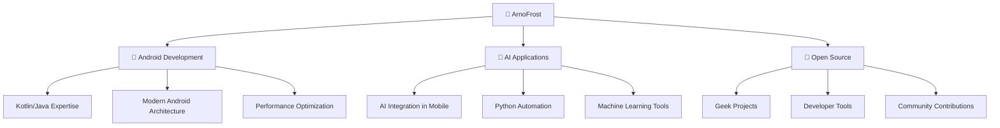

# 👋 Hi there, I'm ArnoFrost!

---

## 📊 GitHub Analytics

  <!-- 详细的用户概要卡片 -->
  

  <!-- GitHub 统计卡片 -->
  
  <!-- 最常用语言卡片 -->
  

  <!-- 连续贡献统计 - 使用 GitHub Profile Summary Cards 替代 -->
  
  <!-- 提交时间分布 -->
  

---

## 🛠️ Tech Stack

### 📱 Android Development (Core)

### 🤖 AI & Machine Learning

### 🌐 Additional Skills

### 🔧 Tools & DevOps

---

## 🎯 Current Focus

```mermaid
graph TB
    A[🚀 ArnoFrost] --> B[📱 Android Development]
    A --> C[🤖 AI Applications]
    A --> D[🔧 Open Source]
    
    B --> B1[Kotlin/Java Expertise]
    B --> B2[Modern Android Architecture]
    B --> B3[Performance Optimization]
    
    C --> C1[AI Integration in Mobile]
    C --> C2[Python Automation]
    C --> C3[Machine Learning Tools]
    
    D --> D1[Geek Projects]
    D --> D2[Developer Tools]
    D --> D3[Community Contributions]
```

---

## 📈 Contribution Activity

  

---

## 🏆 GitHub Achievements

<!-- 使用更稳定的 GitHub Profile Summary Cards 替代 trophy -->

---

## 💼 Professional Summary

**🎯 Android Client Engineer** specializing in **Kotlin & Java**

Passionate about building high-quality mobile applications with modern Android architecture patterns.
Always exploring the intersection of **AI technology** and mobile development.

**🔍 Areas of Interest:**
- 📱 Native Android Development
- 🤖 AI/ML Integration in Mobile Apps  
- 🛠️ Developer Tools & Automation
- 🌟 Open Source Contributions

---

## 📫 Let's Connect

---

## 🐍 Contribution Snake

---

### 💭 Random Dev Quote

**Thanks for visiting! 😄**

