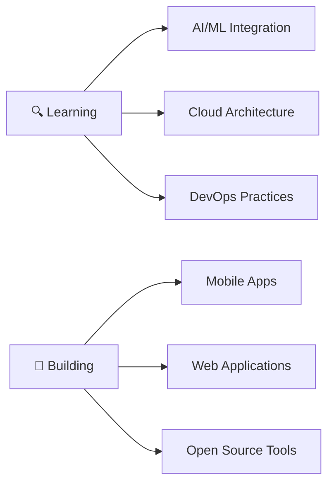

# 👋 Hi there, I'm ArnoFrost!

---

## 📊 GitHub Analytics

  <!-- 详细的用户概要卡片 -->
  

  <!-- GitHub 统计卡片 -->
  
  <!-- 最常用语言卡片 -->
  

  <!-- 连续贡献统计 -->
  
  <!-- 提交时间分布 -->
  

---

## 🛠️ Tech Stack

### 📱 Mobile Development

### 🌐 Web Development

### 🔧 Tools & Others

---

## 🎯 Current Focus

```mermaid
graph LR
    A[🔍 Learning] --> B[AI/ML Integration]
    A --> C[Cloud Architecture]
    A --> D[DevOps Practices]
    
    E[🚀 Building] --> F[Mobile Apps]
    E --> G[Web Applications]
    E --> H[Open Source Tools]
```

---

## 📈 Contribution Activity

  

---

## 🏆 GitHub Trophies

  

---

## 📫 Let's Connect

---

## 🐍 Contribution Snake

---

### 💭 Random Dev Quote

**Thanks for visiting! 😄**

